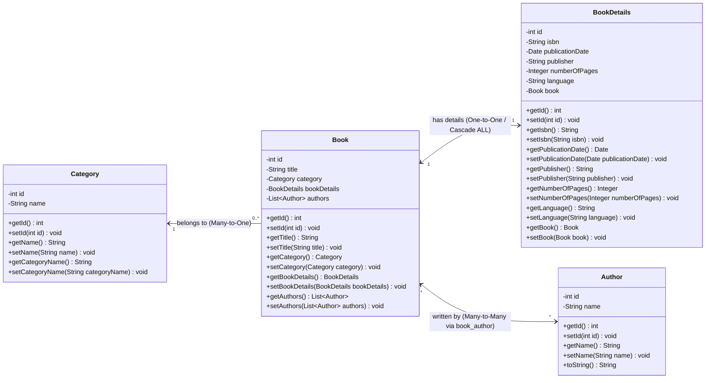

# 📚 Amazon Book Store - Spring MVC & Hibernate Application

An enterprise-grade, full-stack Book Inventory and Management Web Application built with **Spring MVC 4**, **Hibernate ORM 4**, **MySQL**, **JSP/JSTL**, and **Bootstrap 5**.

---

## 📑 Table of Contents
1. [Project Overview](#1-project-overview)
2. [Key Features](#2-key-features)
3. [Technology Stack](#3-technology-stack)
4. [System Architecture](#4-system-architecture)
5. [Project Structure](#5-project-structure)
6. [Database Schema & Data Model](#6-database-schema--data-model)
7. [UML Class Diagram](#7-uml-class-diagram)
8. [Entity Relationships Breakdown](#8-entity-relationships-breakdown)
9. [Endpoints & URL Mapping Reference](#9-endpoints--url-mapping-reference)
10. [Setup & Installation Guide](#10-setup--installation-guide)
11. [Configuration Details](#11-configuration-details)

---

## 1. Project Overview
The **Amazon Book Store** is an interactive web application designed to manage an extensive book catalog with rich multi-entity associations. The system allows users to create, update, delete, view, and search across **Books**, **Categories**, and **Authors**, along with detailed metadata (ISBN, publisher, publication date, page count, and language) encapsulated in a dedicated **BookDetails** entity.

The application follows the classic **Model-View-Controller (MVC)** architectural pattern, separating concerns cleanly across presentation, business logic, and transactional database operations.

---

## 2. Key Features

- **📖 Book Catalog Management**:
  - Full CRUD capabilities for books.
  - Multi-author assignment with interactive checkbox controls.
  - Dynamic category selection with real-time UI preview.
  - Nested publication details (ISBN, Publisher, Publication Date, Number of Pages, Language).
  - Quick-action modals and detailed single-book view (`viewMore.jsp`).

- **🏷️ Category Management**:
  - Create, edit, and delete book genres and categories.
  - Real-time duplicate category name validation.

- **✍️ Author Management**:
  - Register and manage authors with instant name search.
  - Duplicate author name prevention.

- **🎨 Modern UI & UX**:
  - Responsive design powered by **Bootstrap 5.3** and **Bootstrap Icons**.
  - Persistent **Light / Dark Mode** theme toggle.
  - Drag-and-drop / clickable interactive language selection chips.
  - Client-side real-time form validation paired with robust server-side JSR-303/JSR-349 validation.

- **⚡ Performance & Stability**:
  - Eliminates `LazyInitializationException` using optimized **HQL `left join fetch`** queries.
  - Spring-managed declarative transactions (`@Transactional`).
  - Spring `WebDataBinder` with `CustomDateEditor` and `StringTrimmerEditor`.

---

## 3. Technology Stack

| Layer | Technology | Version | Description |
| :--- | :--- | :--- | :--- |
| **Language** | Java | 8 / 17 | Core programming language |
| **Web Framework** | Spring MVC | 4.1.5.RELEASE | MVC dispatching, controller routing, binding |
| **ORM / Persistence** | Hibernate ORM | 4.3.8.Final | JPA annotations, session factory, HQL |
| **Connection Pool** | C3P0 | 4.3.8.Final | High-performance JDBC connection pooling |
| **Database** | MySQL | 8.0.33 | Relational SQL database |
| **Validation** | Hibernate Validator | 5.4.3.Final | JSR-349 Bean Validation (`@NotNull`, `@Size`, `@Pattern`) |
| **View Template** | JSP & JSTL | 1.2 / 3.1 | Server-side rendered views with standard tag library |
| **Frontend UI** | Bootstrap & Icons | 5.3.0 / 1.11.0 | Styling, modal dialogs, dark theme support |
| **Servlet Container** | Apache Tomcat | 9.0.x | Web application container |
| **Build Tool** | Apache Maven | 3.x | Dependency management and build lifecycle |

---

## 4. System Architecture

```
┌─────────────────────────────────────────────────────────────┐
│                       Client Browser                        │
│             (HTML5 / CSS3 / Bootstrap 5 / JS)               │
└──────────────────────────────▲──────────────────────────────┘
                               │ HTTP Request / Response
┌──────────────────────────────▼──────────────────────────────┐
│                    Spring DispatcherServlet                 │
│               (Front Controller - web.xml)                  │
└──────────────▲──────────────────────────────▲───────────────┘
               │                              │
┌──────────────▼──────────────┐┌──────────────▼───────────────┐
│         Controllers         ││         View Resolver        │
│  - HomeController           ││  InternalResourceViewResolver│
│  - BookController           ││  (/WEB-INF/view/*.jsp)       │
│  - CategoryController       │└──────────────────────────────┘
│  - AuthorController         │
└──────────────▲──────────────┘
               │ Invokes Service Layer
┌──────────────▼──────────────┐
│        Service Layer        │
│  - BookService              │   Declarative Transactions
│  - CategoryService          │   (@Transactional)
│  - AuthorService            │
└──────────────▲──────────────┘
               │ Invokes DAO Layer
┌──────────────▼──────────────┐
│       Data Access Layer     │
│  - BookDAO / Impl           │   Hibernate SessionFactory
│  - CategoryDAO / Impl       │   HQL with Join Fetch
│  - AuthorDAO / Impl         │
└──────────────▲──────────────┘
               │ JDBC / C3P0
┌──────────────▼──────────────┐
│      MySQL Database         │
│   (amazon_book_store)       │
└─────────────────────────────┘
```

---

## 5. Project Structure

```
Amazon_Book_Store/
├── pom.xml
├── README.md
├── src/
│   └── main/
│       ├── java/
│       │   └── com/
│       │       └── amazon/
│       │           └── bookstore/
│       │               ├── controller/
│       │               │   ├── AuthorController.java
│       │               │   ├── BookController.java
│       │               │   ├── CategoryController.java
│       │               │   └── HomeController.java
│       │               ├── dao/
│       │               │   ├── AuthorDAO.java
│       │               │   ├── BookDAO.java
│       │               │   ├── CategoryDAO.java
│       │               │   └── daoImpl/
│       │               │       ├── AuthorDAOImpl.java
│       │               │       ├── BookDAOImpl.java
│       │               │       └── CategoryDAOImpl.java
│       │               ├── model/
│       │               │   ├── Author.java
│       │               │   ├── Book.java
│       │               │   ├── BookDetails.java
│       │               │   └── Category.java
│       │               ├── service/
│       │               │   ├── AuthorService.java
│       │               │   ├── BookService.java
│       │               │   ├── CategoryService.java
│       │               │   └── serviceImpl/
│       │               │       ├── AuthorServiceImpl.java
│       │               │       ├── BookServiceImpl.java
│       │               │       └── CategoryServiceImpl.java
│       │               └── util/
│       │                   └── AppConstants.java
│       ├── resources/
│       │   ├── applicationContext.xml
│       │   ├── database.properties
│       │   └── log4j.properties
│       └── webapp/
│           ├── resources/
│           │   ├── css/
│           │   │   └── style.css
│           │   └── js/
│           └── WEB-INF/
│               ├── dispatcher-servlet.xml
│               ├── web.xml
│               └── view/
│                   ├── author-form.jsp
│                   ├── book-form.jsp
│                   ├── category-form.jsp
│                   ├── home.jsp
│                   ├── list-authors.jsp
│                   ├── list-books.jsp
│                   ├── list-categories.jsp
│                   └── viewMore.jsp
```

---

## 6. Database Schema & Data Model

The application uses 4 core relational tables and 1 junction table:

1. **`category`**:
   - `id` (INT, Primary Key, Auto Increment)
   - `category_name` (VARCHAR(255), Not Null)

2. **`author`**:
   - `id` (INT, Primary Key, Auto Increment)
   - `author_name` (VARCHAR(255), Not Null)

3. **`book`**:
   - `id` (INT, Primary Key, Auto Increment)
   - `title` (VARCHAR(255), Not Null)
   - `category_id` (INT, Foreign Key referencing `category.id`)

4. **`book_details`**:
   - `id` (INT, Primary Key, Auto Increment)
   - `isbn` (VARCHAR(255), Unique, Not Null)
   - `publisher` (VARCHAR(255))
   - `publication_date` (DATE)
   - `number_of_pages` (INT)
   - `language` (VARCHAR(255))
   - `book_id` (INT, Foreign Key referencing `book.id`)

5. **`book_author`** *(Junction Table)*:
   - `book_id` (INT, Composite PK / FK referencing `book.id`)
   - `author_id` (INT, Composite PK / FK referencing `author.id`)

---

## 7. UML Class Diagram

Below is the UML Class Diagram detailing the attributes, methods, and structural associations among **Book**, **BookDetails**, **Category**, and **Author**:



---

## 8. Entity Relationships Breakdown

### A. Book & Category (`@ManyToOne` / `@OneToMany`)
- **Relationship**: Multiple books can belong to a single category (e.g. *Science Fiction* contains multiple titles).
- **Foreign Key**: `book.category_id` references `category.id`.
- **Mapping**:
  ```java
  @ManyToOne
  @JoinColumn(name = "category_id")
  private Category category;
  ```

### B. Book & BookDetails (`@OneToOne`)
- **Relationship**: Each book has exactly one record of publication metadata.
- **Bi-Directional**: `Book` owns the relationship with cascade operations; `BookDetails` maps back via `book_id`.
- **Cascade**: `CascadeType.ALL` ensures that saving, updating, or deleting a `Book` cascades automatically to its `BookDetails`.
- **Mapping in Book**:
  ```java
  @Valid
  @OneToOne(mappedBy = "book", cascade = CascadeType.ALL)
  private BookDetails bookDetails;
  ```
- **Mapping in BookDetails**:
  ```java
  @OneToOne
  @JoinColumn(name = "book_id")
  private Book book;
  ```

### C. Book & Author (`@ManyToMany`)
- **Relationship**: A book can be written by multiple authors, and an author can write multiple books.
- **Junction Table**: Managed transparently via `book_author` table.
- **Mapping in Book**:
  ```java
  @ManyToMany
  @JoinTable(
      name = "book_author",
      joinColumns = @JoinColumn(name = "book_id"),
      inverseJoinColumns = @JoinColumn(name = "author_id")
  )
  private List<Author> authors;
  ```

---

## 9. Endpoints & URL Mapping Reference

### 📚 Book Controller (`/book`)
| HTTP Method | Path | Parameters | Description |
| :--- | :--- | :--- | :--- |
| `GET` | `/book/list` | None | Displays book inventory table with categories and authors |
| `GET` | `/book/showAddForm` | None | Renders the Add Book form |
| `POST` | `/book/saveBook` | Form attributes (`book`, `authorIds`) | Validates and persists a new or updated book |
| `GET` | `/book/showUpdateForm` | `@RequestParam("bookId") int id` | Loads book data into the edit form |
| `GET` | `/book/delete` | `@RequestParam("bookId") int id` | Deletes book and cascaded details |
| `GET` | `/book/viewMore` | `@RequestParam("bookId") int id` | Shows comprehensive book detail hero view |

### 🏷️ Category Controller (`/category`)
| HTTP Method | Path | Parameters | Description |
| :--- | :--- | :--- | :--- |
| `GET` | `/category/list` | None | Lists all categories |
| `GET` | `/category/showAddForm` | None | Renders category creation form |
| `POST` | `/category/saveCategory` | Form attribute (`category`) | Saves category with duplicate name checks |
| `GET` | `/category/showUpdateForm` | `@RequestParam("categoryId") int categoryId` | Renders update form for a category |
| `GET` | `/category/delete` | `@RequestParam("categoryId") int categoryId` | Deletes a category |

### ✍️ Author Controller (`/author`)
| HTTP Method | Path | Parameters | Description |
| :--- | :--- | :--- | :--- |
| `GET` | `/author/list` | None | Lists all authors |
| `GET` | `/author/showAddForm` | None | Renders author creation form |
| `POST` | `/author/saveAuthor` | Form attribute (`author`) | Saves author with duplicate name checks |
| `GET` | `/author/showUpdateForm` | `@RequestParam("authorId") int id` | Renders update form for an author |
| `GET` | `/author/delete` | `@RequestParam("authorId") int id` | Deletes an author |

### 🏠 Home Controller (`/`)
| HTTP Method | Path | Parameters | Description |
| :--- | :--- | :--- | :--- |
| `GET` | `/` | None | Dashboard showing real-time counts for Books, Categories, Authors |

---

## 10. Setup & Installation Guide

### Prerequisites
- **JDK**: Java 8 or Java 17 installed and configured in `JAVA_HOME`.
- **Apache Maven**: Version 3.6 or higher.
- **MySQL Server**: Running on `localhost:3306`.
- **Apache Tomcat**: Version 9.0.x.

### 1. Clone Repository
```bash
git clone https://github.com/omar-abdullah-dev/Amazon_Book_Store.git
cd Amazon_Book_Store
```

### 2. Configure Database
Create the MySQL database:
```sql
CREATE DATABASE IF NOT EXISTS amazon_book_store;
```

Update your database credentials in `src/main/resources/database.properties`:
```properties
db.driver=com.mysql.cj.jdbc.Driver
db.url=jdbc:mysql://localhost:3306/amazon_book_store?useSSL=false&allowPublicKeyRetrieval=true&serverTimezone=UTC
db.user=your_mysql_user
db.password=your_mysql_password
```

### 3. Build Application
Compile and package the WAR artifact using Maven:
```bash
mvn clean compile
mvn clean package
```
The compiled archive will be generated at `target/Amazon_Book_Store.war`.

### 4. Deploy to Apache Tomcat
1. Copy `target/Amazon_Book_Store.war` into Tomcat's `webapps/` folder, **or**
2. Deploy directly via IntelliJ IDEA / VS Code Smart Tomcat plugin configured with Context Path: `/Amazon_Book_Store`.

### 5. Access Application
Open your browser and navigate to:
```
http://localhost:8080/Amazon_Book_Store/
```

---

## 11. Configuration Details

### Hibernate Configuration (`applicationContext.xml`)
- **C3P0 Connection Pool**:
  - `minPoolSize`: 5
  - `maxPoolSize`: 20
  - `maxIdleTime`: 30000
- **Hibernate Properties**:
  - `hibernate.dialect`: `org.hibernate.dialect.MySQLDialect`
  - `hibernate.show_sql`: `true`
  - `hibernate.format_sql`: `true`
  - `hibernate.hbm2ddl.auto`: `update` (automatically creates or updates tables)
- **Transaction Management**:
  - Configured with `org.springframework.orm.hibernate4.HibernateTransactionManager`.
  - Driven by `<tx:annotation-driven transaction-manager="myTransactionManager" />`.

---

## 👥 Authors & Contributions
Developed as part of the Enterprise Java & Spring MVC Bootcamp. All contributions, enhancements, and pull requests are welcome!
